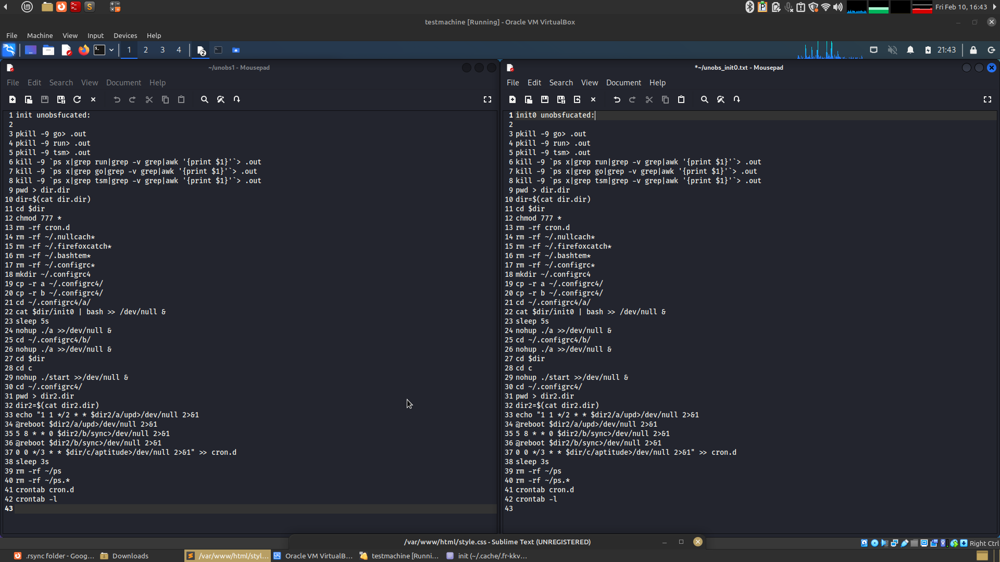

# Dota3 analysis 

This is a breakdown of some of the things I found when rooting around in dota3.tar.gz as pulled from hostile host 67.205.134.224 (ref. https://www.abuseipdb.com/check/67.205.134.224) 

As a general summary of findings: 

Application has 3 subdirs that effectively house 3 applications with different functionalities -- a, b and c. 

A seems to be the XMrig cryptominer and associated automations for determining the suitability of the host's CPU and killing any competing miners that are discovered. It also contains a distribution of Tor, which is used as a fallback channel to send mining data over. 

B is an IRC bot based C2 channel that's executed as obfuscated perl. It more or less would give the threat actor access to a shell through an IRC server. 

C appears to be an infector, which causes the victim machine to attempt to spread the malware to other hosts. The actual infectors are compiled ELF binaries and I am unable to reverse them at this time. 

45.9.148.228 is a pretty constant IP indicator, appearing to be both the primary tunnel for the miner as well as the endpoint that the IRC bot reaches out to. This should be compared to future 


## File structure of the Package 

Inside of the dota3.tar.gz archive, we have the following (terminal output for ls -R): 

 
``` 
.rsync/:
a  b  c  init  init0  init2  initall

.rsync/a:
a  init0  kswapd0  run  stop  tors

.rsync/a/tors:
bin  cleandirs.sh  share  start.sh  stop.sh

.rsync/a/tors/bin:
tor  tor-gencert  torify  tor-print-ed-signing-cert  tor-resolve

.rsync/a/tors/share:
tor

.rsync/a/tors/share/tor:
geoip  geoip6

.rsync/b:
a  run  stop

.rsync/c:
blitz  blitz32  blitz64  c  d  go  golan  run  slow  start  stop  v  watchdog

```


## The root directory scripts 

These four came as obfuscated shell scripts. Structurally, these were set up as a large series of variables that contain pieces of commands and statements, as if to snip up and scatter the script such that it's unreadable. Following these variables, there's an eval statement followed by all of the variables from above. This reassembles the "snipped" shell script and executes it. 

And example can be seen of how this looks here: 


Unobfuscating these safely was fairly simple: by replacing "eval" with "echo" the malware would simply print its unobfuscated content rather than execute it. 

These can be examined in the following images: 




I'm unsure, but it appears that these 4 files variously stop all processes associated with the malware, restart them, and start a cron job related to the rest of the activity of the malware. 

## .rsync/a

### .rsync/a/a

- Looks like it checks for CPU type and enables 1GB memory paging. 
- makes a file called upd that checks for something; I believe this may be checking to see if "a" has been run before. 

### 45.9.148.228

referenced in "a" script 

```
#connok=$(ping -c 1 45.9.148.228 | echo $?)                                                                                                                       
```

Pinging to see if it can phone home to c2? It looks like one of those usual suspect dutch IPs... 

ISP/Host's webpage as49447.net is a 502'd nginx install 

This IP gets referenced elsewhere in the package and seems to be the C2 server. 

#### Nmap (-vvv -Pn not sudo) 

```
All 1000 scanned ports on 45.9.148.228 are filtered because of 1000 no-responses
```

No go T_T

Guessing it's either not active anymore, or else possibly just secure against basic nmap. Since this is a live site I don't have permission to touch, I'm not going to try to be more aggressive from my home IP. 


### .rsync/a/init0

Openly declares in a comment that it's a crypto miner *killer*. Possibly being used to kill other miners in preparation to run the threat actors own? 

references 2 pastebins: 

1. https://pastebin.com/pxc1sXYZ (dead link)
2. https://pastebin.com/jRerGP1u (dead link)

### .rsync/a/kswapd0 

Binary file. Begins 7f45 (magic bytes for ELF -- i.e a Linux executable) 

strings command shows: "UPX!h" on line 1

Possibly packed with UPX (a common executable packer)? Reference: https://upx.github.io/ 

Loaded in ghidra, but I'm not experienced enough to make heads or tails of it. 

VT pings it as variously as a linux shell or crypto miner. 

https://www.virustotal.com/gui/file/55237c4fa83c4b3a96cb0d5068dc9deea4c20aa23bdc71c449c67b7848153c68

Probably the coin miner itself, based on what the scripts around it do. 

Note that kswapd0 is the name of a normal linux daemon -- the legitimate file is responsible for allocating the page file. 


### .rsync/a/run 

Forms an SSH connection with 45.9.148.228. If it fails, it runs /tors/start.sh. Seems like it's building a tunnel back home... 
Next, runs kswapd0. 

### .rsync/a/stop 

Kills kswapd0, cron, and uses chattr and lockr to set XMRig config single-file DBs to read only 

## .rsync/a/tors/

### .rsync/a/tors/start.sh 

Seems to create 11 seperate tor configurations and starts a tor instance as a daemon for each. 

### the rest of the directory...

- the subdirs all seem to be redistributable executables necessary to use Tor
- stop.sh kills the tor processes 
- cleandir isn't too clear to me what it does. 

## .rsync/b

### .rsync/b/run 

- This is a massive block of base64 encoded perl. The perl is obfuscated, but it's pretty simple and runs an "eval unpack" statement. 
- Changed eval to print, stapped in and ran it. Deobfuscated output was returned and availible. 
- Language used in the deobfuscated code seems to be portuguese, e.g. "CONFIGURACAO" etc. 
- shell config back to 45.9.148.99:443 
- seems to be an IRC bot that somehow serves as C2 through an IRC channel

This seems to be an obfuscated example of shellbot.pl https://github.com/nikicat/web-malware-collection/blob/master/Bots/Perl/shellbot.pl

Note that this is ancient technology -- that github last saw a commit in 2012! 

Speculating: The Dota3 threat actor is probably using this as an off the shelf component and is not likely the dev behind this shell. 


## .rsync/c

### .rsync/c/go 

- seems to call blitz script

### .rsync/c/blitz 

detects arch and runs either blitz32 or blitz64

### The 2 blitzXX files 

Both of these are ELF files that detect under headings related to SSH bruting on VT 

- https://www.virustotal.com/gui/file/afa39935900937d66f9f2c956f8c2c13fe5db76da6aa37061184af689d5d2458   -- 32 bit 
- https://www.virustotal.com/gui/file/47ff22f7d0cea47551ebbde847a80bfc898026129ad08ee734f2a83bf2601a20  -- 64 bit 

Possibly the spreader, but there's no way too definitively tell unless someone knows how to analyse these in ghidra or something.  

### .rsync/c/watchdog 

kills and restarts "go" under particular conditions. Note that watchdog is likely named after the legitimate Linux application watchdogd. 
